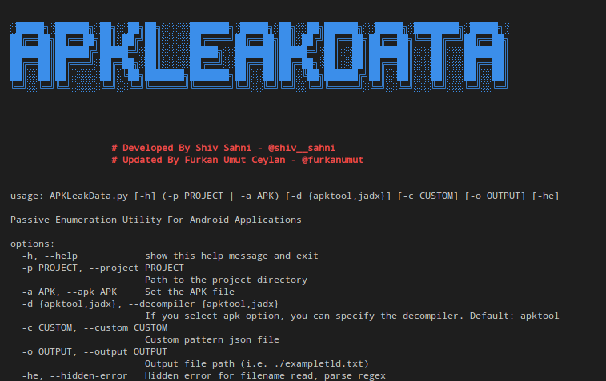
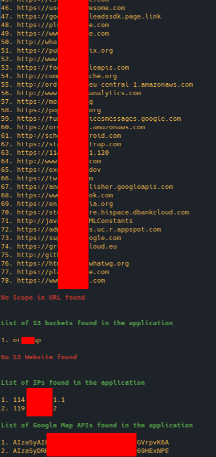

# APKLeakData: Passive Enumeration Utility For Android Applications

 




## Usage
The utility takes APK file as an input, performs reverse engineering and gathers information from the decompiled binary. As of now, the script provides the following information by searching the decompiled code:

* List of **domains** in the application

* List of **S3 buckets** referenced in the code

* List of **S3 websites** referenced in the code

* List of **IP addresses** referenced in the code

* List of **Google Maps API** Keys in the code

* List of **Custom Patterns** in the code



| Argument   | DESCRIPTION   | EXAMPLE 
|---|---| --- |
| -h  | show help message and args list  | APKLeakData.py -h    |
| -p  | Set project path (apktool decomple output path)  |   pyhon APKLeakData.py -p ~/decompile-apk-path  |
| -a | Set apk file | python APKLeakData.py -a apkfile.apk
| -d | If the apk file is selected, you can choose the decompiler. (Apktool or jadx). Default: apktool | python APKLeakData.py -a apkfile.apk -d jadx
|  -c |  Custom regext pattern file location. File format: Json |  pyhon APKLeakData.py -p ~/decompile-apk-path -c custom_search.json   |
| -he | Hidden File reading error(binary file) | pyhon APKLeakData.py -p ~/decompile-apk-path -he |
| -o | Output file path/name | pyhon APKLeakData.py -p ~/decompile-apk-path -o ~/leak-data.txt |

## Custom Pattern File
The file must be in json format. You can use multiple patterns in one value. 

```json
{
    // EXAMPLE
    "Pattern Name for list name": "regex parameter",
	"Pattern with Scope":{
        "scope": "example.com,example2.com,cdn,other.com",
        "regex": "regex parameter"
    },

    "Multiple Pattern": [
        "regex",
        "regex2"
    ],
    "Multiple Pattern with Scope":{
        "scope": "example.com,example2.com,cdn,other.com",
        "regex": [
            "regex",
            "regex2"
        ],
    },

    // USAGE:
    "Google_API_Key": "AIza[0-9A-Za-z\\-_]{35}",
    "Firebase": [
		"[a-z0-9.-]+\\.firebaseio\\.com",
		"[a-z0-9.-]+\\.firebaseapp\\.com"
	],
    "Url Find": {
        "scope": "domain.tld"
        "regex": [
            "http[s]?://(?:[a-zA-Z]|[0-9]|[$-_@.&+]|[!*\\(\\),]|(?:%[0-9a-fA-F][0-9a-fA-F]))+"
            ]
    },
}
```
If you want a prepared pattern file, you can use the custom_search.json file.

The larger the file, the longer it will take. You can set yourself a json which can be critical information for quick scan.

## New Feature
- It now works with Python 3.
- "argparse" was used in the argument section, so less if-else was used, it was clean code for arg parse.
- Repeated codes were organized for Thread. Function was used for repetitive codes.
- Custom Pattern has been added for the user to search.


## What I plan to do
- [X] Now we can only use the decompile project with APKTOOL. But I want to add it from the APK file and analyze it. (Now use apktool or jadx)
- [X] Save the output to a file.
- Allow the thread limit from the user. In this way, I think it will work faster by increasing the thread limit.